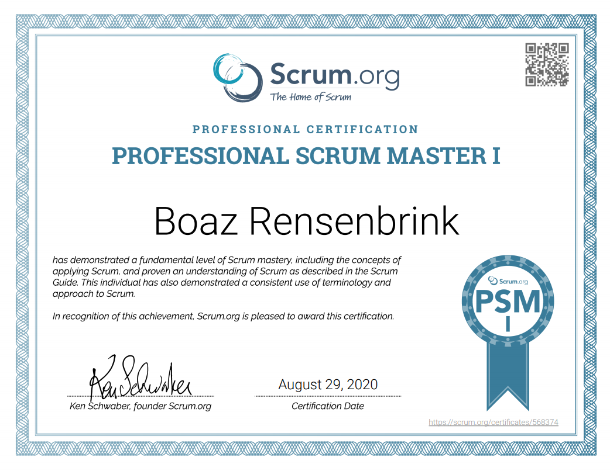

## Boaz Rensenbrink

### Cover Letter for My Future Employer

Dear Ms. or Mr. 

I would like to express my interest in the position of question.

Eversince I succesfully introduced a made to fit agile framework in to Singelfilm and coached the organization and it's members in adapting the new mindset, I like to practise scrum in my daily life and my journey started to take shape.
Sadly Singelfilm developted and maintained a unrealistic company view and strongly started to enforced this unsustainable vision. In combination with a dear family loss and not being able to get the appropriate space within Singelfilm, I decided to go on sabbatical leave and I traveld in Europe, the Middle East & Asia for one year. 
Now my goal was more clear than ever and I tried my luck applying for scrum master roles. Surely I found out this was very ambitious and never landed a second interview. 
Not wanting to wait, I openend a freelance company and offered my knowledge & expertice this way. Sadly without luck. I started to volunteer so I wouldn't alianate in a applying bubble and lose my coaching abilities.

 
I would like to have the opportunity to talk to you about my candidacy for the role in question and discuss it over a cup of coffee.

I look forward to your response and your consideration is much appreciated.

With kind regards & thanks in advance,  

Sincerely,

Boaz Rensenbrink

### Professional Scrum Master Certificate  (PSM I)
[Certificate Credential Link](https://www.scrum.org/certificates/568374)

### Certified Scrum Master Certificate  (CSM)
[Certificate Credential Link](https://www.credential.net/cdf72282-aa89-4c81-8e24-120375555c3d)

### HTML,CSS, JavaScript Fundementals Certificate  (Front End Development Certificate)

### Contact

[GitHub](https://boaz-rensenbrink.github.io/scrum/)

[LinkedIn](https://www.linkedin.com/in/boaz-rensenbrink/) 

[Business Page](http://scrumwithboaz.nl/)

[Business LinkedIn](https://www.linkedin.com/company/umbrellaconsult/about)

[Info@ScrumWithBoaz.nl](http://scrumwithboaz.nl/https/-/scrumwithboaz-nl/)

----------------------------------------------------

## Boaz Rensenbrink

### Motivatie brief voor mijn toekomstige werkgever

Geachte mevrouw of mijnheer,

Graag toon ik mijn interesse in uw openstaande vacature.

Naast het runnen van een eigen consultancybedrijf, voorzitter van mijn VVE en interatie coach voor vluchtelingen heb ik ook een lange staat van dienst als agile project coordinator en senior team lead bij Singelfilm en de Hocras, en zal ik een goede aanvulling voor uw bedrijf zijn. 

Ik heb meer dan 10 jaar ervaring in verschillende industrieën en mijn vorige bedrijven geholpen om de klanten bestand met succes uit te breiden en sterke klantrelaties te onderhouden naast het introduceren van nieuwe werkwijzen om samenwerking en efficiëntie te bevorderen.
Ik oefen graag verschillende ideeën in mijn leven en ben momenteel zeer geïnteresseerd in back-end development, bedrijfs infrastructuur, agile raamwerken en doelgerichte educatie. 
Ik geloof dat mijn enthousiasme, creativiteit en motivatie me zal leiden naar een onmisbare schakel die uw bedrijf fundamenteel helpt. 

Ik kijk uit naar uw reactie en bedankt voor uw tijd. 

Met vriendelijke groeten en bij voorbaat dank, 

Boaz Rensenbrink

### Contact

[GitHub](https://boaz-rensenbrink.github.io/scrum/)

[LinkedIn](https://www.linkedin.com/in/boaz-rensenbrink/) 

[Zakelijke Pagina](http://scrumwithboaz.nl/)

[Zakelijke LinkedIn](https://www.linkedin.com/company/umbrellaconsult/about)

[Info@ScrumWithBoaz.nl](http://scrumwithboaz.nl/https/-/scrumwithboaz-nl/)

