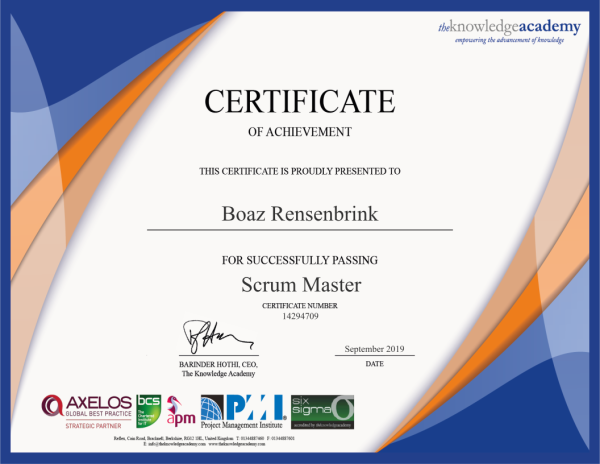

## Boaz Rensenbrink

### Cover Letter for My Future Employer

Dear Ms. or Mr.

I would like to express my interest in the position of question.

Having my own consultancy company and long track record as a project manager and a team lead at Singelfilm and Hocras, I believe I will bring value to your company.

Although I do not have a HBO degree, I have contributed more than 10 years of experience to a variety of industries and helped my previous companies to successfully expand the client databases and maintained strong client relationships while introducing new frameworks that foster collaboration and efficiency. 
I like to practice various ideas in my life and I'm currently highly interested in full-stack software engineering, business infrastructure, agile frameworks and effective education. 
I believe my enthusiasm & creativity will lead me to a great asset within your company and helps the team fundamentally.

Please take a moment to view my enclosed resume. 
I would like to have the opportunity to talk to you about my candidacy for the role in question and discuss it over a cup of coffee.

I look forward to your response and your consideration is much appreciated.

With kind regards & thanks in advance,  

Sincerely,

Boaz Rensenbrink

### Professional Scrum Master Certificate (PSM I)
[Certificate Credential Link](https://www.scrum.org/certificates/568374)

### Certified Scrum Master Certificate (CSM)
[Certificate Credential Link](https://www.credential.net/cdf72282-aa89-4c81-8e24-120375555c3d)

### HTML,CSS,JavaScript fundementals (Front End Development Certificate)

### Contact

[LinkedIn](https://www.linkedin.com/in/boaz-rensenbrink/) 

[Business Page](http://scrumwithboaz.nl/)

[Business LinkedIn](https://www.linkedin.com/company/umbrellaconsult/about)

[Info@ScrumWithBoaz.nl](http://scrumwithboaz.nl/https/-/scrumwithboaz-nl/)

[GitHub](https://boaz-rensenbrink.github.io/scrum/)

----------------------------------------------------

## Boaz Rensenbrink

### Motivatie brief voor mijn toekomstige werkgever

Geachte mevrouw of mijnheer,

Graag toon ik mijn interesse in uw openstaande vacature.

Naast het runnen van een eigen consultancybedrijf en een lange staat van dienst als project manager en team lead bij Singelfilm en de Hocras, zal ik een goede aanvulling voor uw bedrijf zijn. 

Hoewel ik geen HBO-diploma heb, heb ik meer dan 10 jaar ervaring in verschillende industrieën en mijn vorige bedrijven geholpen om de klanten bestand met succes uit te breiden en sterke klantrelaties te onderhouden naast het introduceren van nieuwe werkwijzen om samenwerking en efficiëntie te bevorderen.
Ik oefen graag verschillende ideeën in mijn leven en ben momenteel zeer geïnteresseerd in software engineering, bedrijfs infrastructuur, agile werkwijzen en doelgerichte opleiding. 
Ik geloof dat mijn enthousiasme en creativiteit me zal leiden naar een onmisbare schakel die uw bedrijf fundamenteel helpt. 

Graag krijg ik de kans om mijn cv en motivatie met u door te nemen en uw vragen te beantwoorden.

Ik kijk uit naar uw reactie en bedankt voor uw tijd. 

Met vriendelijke groeten en bij voorbaat dank, 

Boaz Rensenbrink

### Contact

[LinkedIn](https://www.linkedin.com/in/boaz-rensenbrink/) 

[Zakelijke LinkedIn](https://www.linkedin.com/company/umbrellaconsult/about)

[Zakelijke Pagina](http://scrumwithboaz.nl/)

[Info@ScrumWithBoaz.nl](http://scrumwithboaz.nl/https/-/scrumwithboaz-nl/)

[GitHub](https://boaz-rensenbrink.github.io/scrum/)
